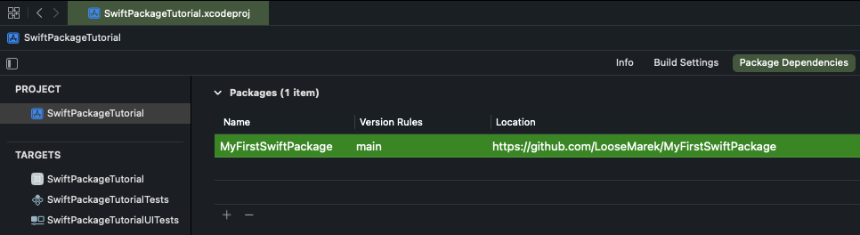
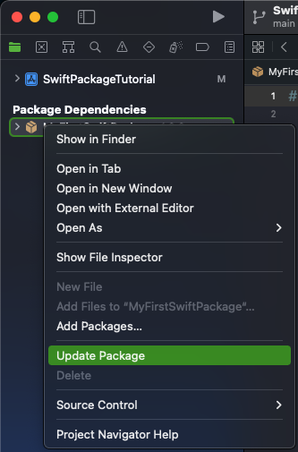
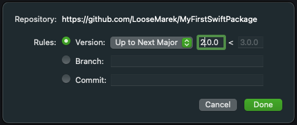
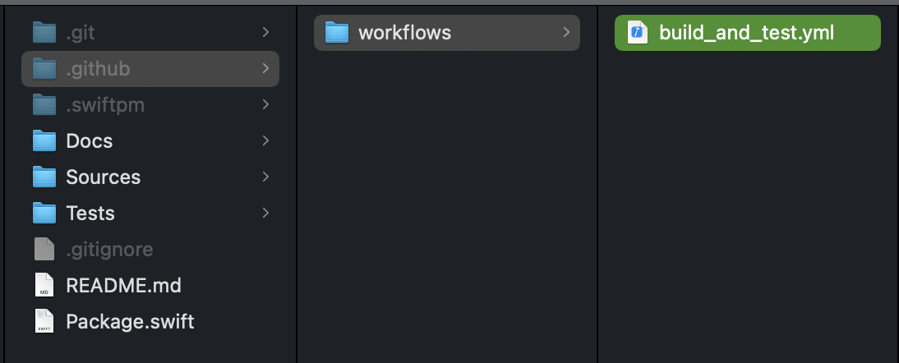
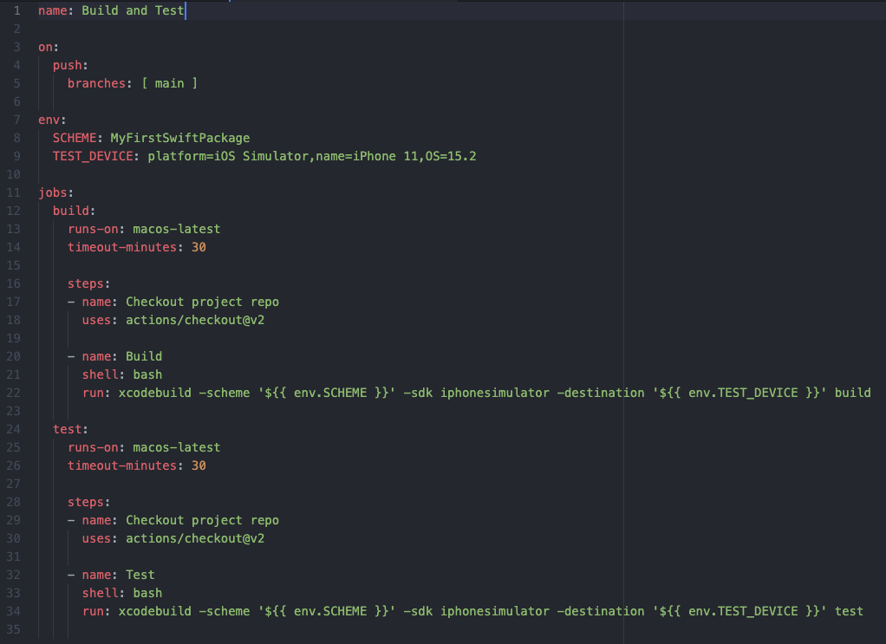
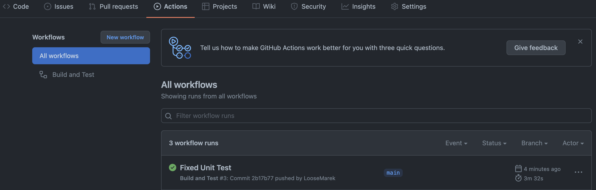
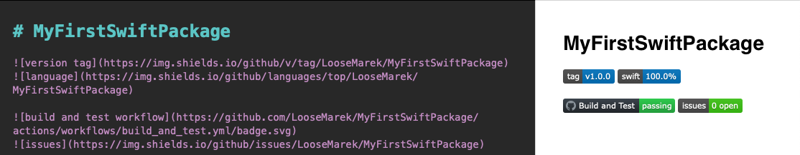

# MyFirstSwiftPackage

 

 

# Swift Package CI with GitHub Actions

Up-to-date with Xcode 13.2.1!

## Intro

This article is a continuation of the [Quick and Simple Modularising Your Project with Swift Packages](https://github.com/LooseMarek/SwiftPackageTutorial) tutorial where we created a local Swift Package and then moved it to the remote repository so we could reuse the module across multiple projects. 

This time, we will go through some additional setups, such as versioning the package, upgrading the package in your project, and creating simple CI with GitHub Actions.

If you haven’t read the previous article, I encourage you to do so to have the same starting point, however, that’s not mandatory to complete the below steps.

## Versioning Swift Package

You are probably very familiar with the Xcode App versioning system - you can change the version by opening your project settings in Xcode, selecting the app target, choosing the General tab, and changing the Version or/and Build number, which appears in the repository as the change to `MARKETING_VERSION` and `CURRENT_PROJECT_VERSION` in `.xcodeproj/project/pbxproj` file.
If you are using GitFlow, you are most likely doing those steps and committing change during a new release which - upon finishing - is adding a new Git tag with the version number you specify. 

Here comes the beauty of the Swift Package. The versioning of your Package is much simpler as there is no file to edit the version. Your `Package.swift` configuration does not declare the Package version. All the magic happens with the Git tags! In fact, you don’t even need to version your Swift Package, and you can use it by referring to the Git branch (which we did in the previous article), although, if you think of continuing developing your Package and keeping it public, it might be much more maintainable to start adding the version tags.

Feel free to add the first version tag in your Package Git, and call it `1.0.0`. Don’t forget to also change the Version Rules of your Package used in the project from Branch to Version. 

In Xcode, select your **Project** and under the **Package Dependencies** in the **Packages** section, double click your Package.

    

The recommended rule is to use Version “Up to Next Major”. Press **Done** to finish.

    

**IMPORTANT: The version tag must contain only numbers separated by dots in a common major.minor.patch version pattern.**

## Updating Swift Package

Updating Swift Package in your project is a very trivial task. In fact, if you set the Version Rules to be “Up to Next Major” and recompile the project, Xcode will automatically pull the latest Minor version of your Package (or any other third-party Packages) for you.

In a few clicks, you can also do it manually, simply, by right-clicking on the Package in Xcodes’ Project Navigator and selecting **Update Package**.

    

Keep in mind, that with the “Up to Next Major” version rule in use, when the Major version of the Package will change, the **Update Package** won’t pull that version. 
To fix that, in Xcode, select your **Project** and under the **Package Dependencies** in the **Packages** section, double click your Package. In the popup window, bump the version to the latest Major version and press **Done**.

    

### Troubleshooting

#### Swift Package is not recognized by the Xcode project

With any issues related to Swift Package used in your project (project unable to compile, importing Package in Swift files can’t find dependency in the scope, and any other), the best silver bullet to resolve them all is to remove and re-add the Swift Package to the project.
To remove the Package, select your **Project**, and under the **Package Dependencies** in the **Packages** section. Single-click your Package, and press the minus “-” button below. 
Then, re-add the Package by following the steps in the [Quick and Simple Modularising Your Project with Swift Packages](https://github.com/LooseMarek/SwiftPackageTutorial) tutorial.

## Use GitHub Actions to Build a Simple CI for Your Swift Package

By hosting your Swift Package repository in GitHub, you are getting access to the [GitHub Actions](https://github.com/features/actions) which may build and test your Package. 
As of the time of writing this article, if you have a Free account, you will have a total of 2000 minutes per month for running your GitHub Action workflows. There is a catch, though. If you are running your workflows on a macOS (which you need, to build the Swift Packages) each minute counts as 10 minutes, so this works out for three hours and 20 minutes of total run time. But don’t worry - if you will use the Swift Packages to keep small, quickly testable components, your builds will take about three to five minutes, so you most likely won’t hit that monthly threshold. 
You can read more about this in the [billing](https://docs.github.com/en/billing/managing-billing-for-github-actions/about-billing-for-github-actions) section of the GitHub documentation.

The entire workflow setups bring down to creating one YAML file containing 35 lines of code (25 lines without spacing) inside `.github/workflows` directory (you will need to create those folders as well). That’s all.

Yes, it’s that simple!

    

Your YAML file looks like [this](https://github.com/LooseMarek/MyFirstSwiftPackage/blob/main/.github/workflows/build_and_test.yml):

    

A brief overview of what is happening in that workflow is as follows:

- (lines 3-5) Workflow triggered by the push to the main branch
- (lines 7-9) Setup scheme name to build and test simulator as environment variables
- (lines 12-22) Build job which checks out the repository and builds the Package with the `xcodebuild…build` command in the bash
- (lines 24-34) Test job which checks out the repository and tests the Package with the `xcodebuild…test` command in the bash

Finally, commit the changes and push/merge them to the main branch. The workflow will trigger automatically and you will be able to see the results on GitHub under the **Actions** tab.

    

**NOTE: If you were created your Swift Package based on the [MyFirstSwiftPackage](https://github.com/LooseMarek/MyFirstSwiftPackage) example, the test job may fail as the `testExample()` wasn’t updated with the change of the example label. You should also get an email notification about the failing job. Change the test assertion to “Hello, World from Swift Package!” to fix it.**

## Bonus Tip: Creating Dynamic Tags in Your Documentation

If you made your Swift Package public, you may consider adding [Shields IO](https://shields.io/) tags to your `README.md` file. This will give a quick overview of your Package such as version, language, issues count, and many more.
If you completed the previous step, you can add the status of the project as well.
All of those tags may help other developers to decide if it’s worth using your Package.

The syntax for the tags in the MarkDown file is the same as for images, which is ``.

    

**Note: For better clarity of the failing CI job, you may want to break .github/workflows/build\_and\_test.yml workflow into two separate workflows (one for build and one for test) and have two separate tags in the documentation.**

## Resources
- Swift Package Manager - https://www.swift.org/package-manager/
- GitHub Actions - https://github.com/features/actions
- GitHub Actions Billings - https://docs.github.com/en/billing/managing-billing-for-github-actions/about-billing-for-github-actions
- Shields IO - https://shields.io/
- SwiftPackageTutorial project example https://github.com/LooseMarek/SwiftPackageTutorial
- MyFirstSwiftPackage Swift Package example https://github.com/LooseMarek/MyFirstSwiftPackage
